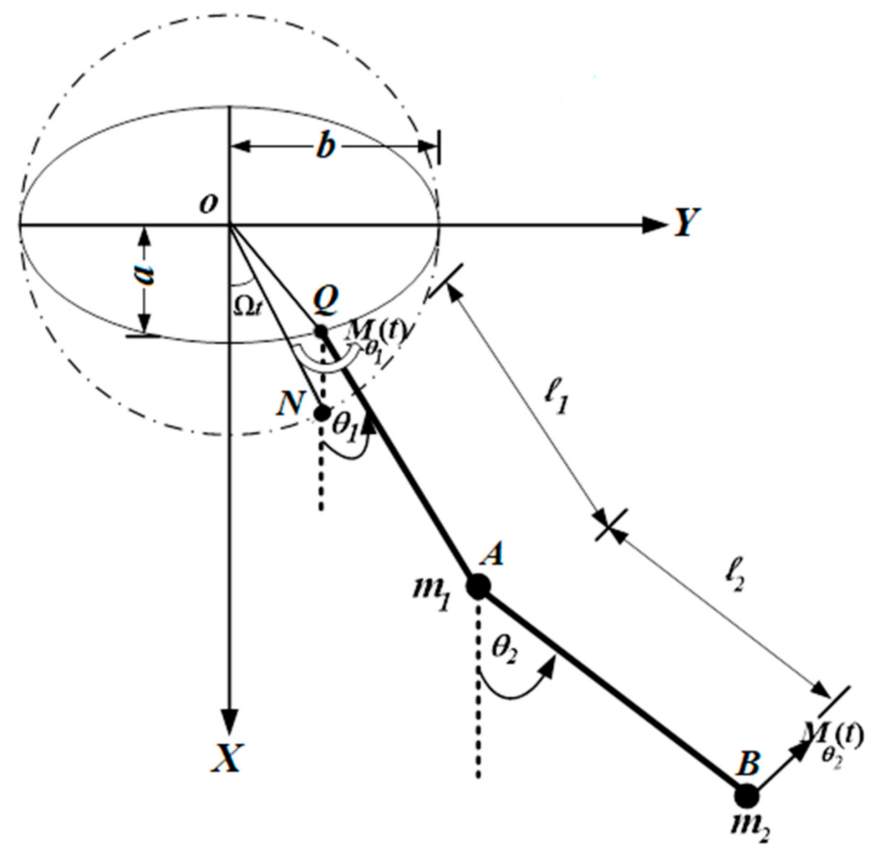

# Analytics and Me

#### Technical Skills: Python, MATLAB, R

## Education
B.A., Physics and Economics | Macalester College (_May 2024_)

## Professional Experience

**Investment Analyst | Macalester Investment Group**
- Impact: portfolio grew from $85K to $100K over three years, achieving a team return of 41% while sustaining a Sharpe ratio above 2.

**Physics Research Associate | Thin Film Lab: Department of Physics and Astronomy**
- Published a study comparing post-deposition annealed ZnO to the industry standard deposition.
- Compiled and analyzed spectrographic, x-ray, and resistivity measurements to understand the ZnO films' crystal quality, transparency, and conductivity.

**Financial Advisory Summer Analyst | Lazard**
- Conducted research and analytics for Data Strategy, Business Management, and Capital Markets.
 
## Projects and Publications

### Effects of Post-Deposition Annealing on Room-Temperature Deposited Zinc Oxide
[Publication](https://digitalcommons.macalester.edu/mjpa/vol12/iss1/10/)

In this study, I investigated the effects of post-deposition annealing on ZnO thin films deposited via magnetron sputtering, aiming to optimize conductivity, transparency, and crystal quality. After fabricating 20+ thin films and analyzing their properties pre and post-anneal, I identified 250°C as the ideal annealing temperature, achieving a 3.86-fold increase in conductivity with minimal loss of transparency. However, I found no significant improvement in crystal quality, and the films remained less conductive than industry standards. My work contributes valuable insights into balancing film properties for potential applications.

### Double (Chaos) Pendulum
[Project](https://github.com/IshanRayen/Chaos_Pendulum)

A double pendulum is a mechanical system that mimics a normal pendulum but it includes two degrees of freedom. The peculiarity of this system is that the motion of the first and second pendulum is chaotic. For the pendulum, chaos is seen as a seemingly random movement that is difficult to predict. In this project, I solve for the positions of mass 1 and mass 2 given a set of variable initial conditions including the mass of each pendulum, length of each pendulum, gravity, initial angle, initial angular velocity, and time. The final output is a set of x and y positions of each mass plotted as dots on a two-dimensional plane. This is then animated to show the pathing of the masses. I also model the pathing of the pendulum when it is under the conditions of a normal mode.

 

