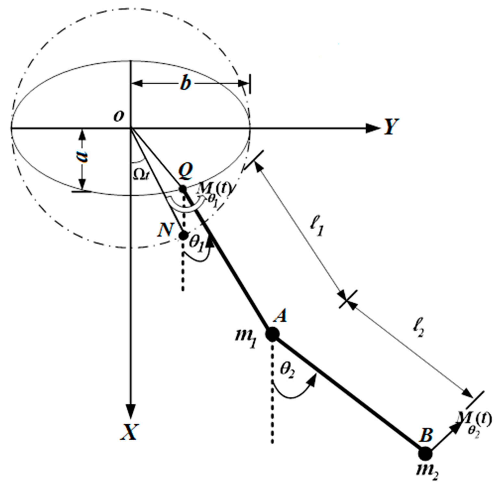

# Analytics and Me

## Education
B.A., Physics and Economics | Macalester College (May 2024)
 
## Projects and Publications

### Effects of Post-Deposition Annealing on Room-Temperature Deposited Zinc Oxide
[Publication](https://digitalcommons.macalester.edu/mjpa/vol12/iss1/10/)

In this study, I investigated the effects of post-deposition annealing on ZnO thin films deposited via magnetron sputtering, aiming to optimize conductivity, transparency, and crystal quality. After fabricating 20+ thin films and analyzing their properties pre and post-anneal, I identified 250°C as the ideal annealing temperature, achieving a 3.86-fold increase in conductivity with minimal loss of transparency. However, I found no significant improvement in crystal quality, and the films remained less conductive than industry standards. My work contributes valuable insights into balancing film properties for potential applications.

### Double (Chaos) Pendulum
[Project](https://github.com/IshanRayen/Chaos_Pendulum)

A double pendulum is a mechanical system miming a normal pendulum but includes two degrees of freedom. For the pendulum, chaos is seen as a seemingly random movement that is difficult to predict. In this project, I solve for the positions of mass 1 and mass 2 given a set of variable initial conditions including the mass of each pendulum, length of each pendulum, gravity, initial angle, initial angular velocity, and time. The final output is a set of x and y positions of each mass plotted as dots on a two-dimensional plane. This is then animated to show the pathing of the masses. I also model the pathing of the pendulum when it is under the conditions of a normal mode.

 

### Heat Dissipation Model
[Project](https://github.com/IshanRayen/Heat_Dissipation_Model)

This project seeks to understand and animate the dissipation of heat through an object. It uses the Finite Difference Method and the Heat Equation.

